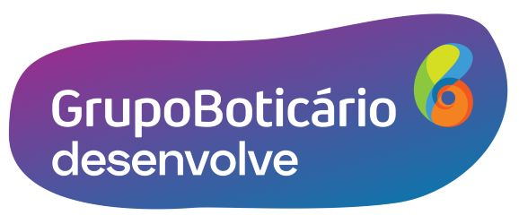

<h4 align="center">
     <b>Boticário - Desenvolve2022 </b>:copyright:
</h4>

 
     

     
     

<>[Alura](https://www.alura.com.br/)</>

  

<h4><b> Language and Tools:</h4></b>

<h2 align="center">
     Aulas ministradas pela plataforma:
     </h2> 
<h3 align="center">Trilha de formação: Full Stack</h3>

 
     

     
     

